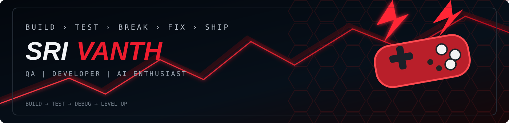
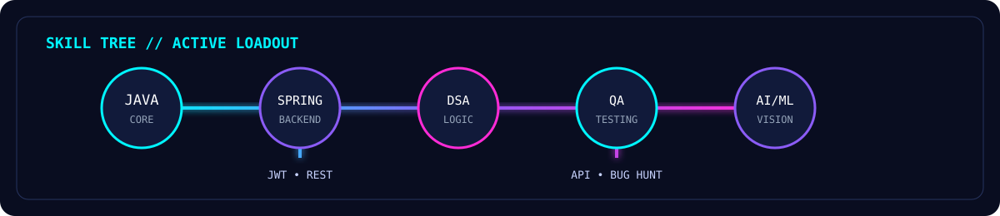

<div align="center">



# 🎮 SRIVANTH S

### ⚡ **PLAYER 01 • JAVA DEVELOPER • QA ENGINEER • AI/ML BUILDER**

`JAVA` `SPRING BOOT` `DSA` `API TESTING` `AI/ML`

> **BUILD → TEST → DEBUG → LEVEL UP**

[](https://linkedin.com/in/srivanth-sekar12)
[](mailto:srivanthsekar11@gmail.com)

</div>

---

## 🕹️ PLAYER PROFILE

```text
╔══════════════════════════════════════════════╗
║                 PLAYER 01                    ║
╠══════════════════════════════════════════════╣
║ CLASS        : JAVA DEVELOPER                ║
║ SECONDARY    : QA ENGINEER                   ║
║ SPECIAL      : AI / COMPUTER VISION          ║
║ WEAPONS      : Java • Spring Boot • REST     ║
║              : DSA • SQL • Git               ║
║              : Postman • OpenCV              ║
║                                                ║
║ CURRENT QUEST: LEVEL UP BACKEND SKILLS       ║
╚══════════════════════════════════════════════╝
```



---

## 🎯 CURRENT QUEST

> **Objective:** Become a stronger backend developer while building software with a quality-first mindset.

- ⚔️ Mastering **Java + DSA**
- 🛡️ Building **Spring Boot REST APIs**
- 🔐 Learning **JWT, Security & Backend Architecture**
- 🧪 Strengthening **API, Functional & Regression Testing**
- 🤖 Exploring **Computer Vision & practical AI**

---

## 🧰 LOADOUT

### ⚔️ MAIN WEAPONS — PROGRAMMING


### 🏰 BACKEND / WEB


### 💾 INVENTORY — DATABASE & TOOLS


### 🤖 SPECIAL ABILITIES — AI / VISION


---

# 🏆 QUEST LOG — PROJECTS

### ⚔️ CODEARENA
**Competitive Coding Platform + AI**

`JWT AUTH` `LIVE JUDGE` `AI HINTS` `LEADERBOARDS` `ANALYTICS`

Built with Python, Flask, MySQL, JavaScript, REST APIs and Groq LLM.

**🎮 [ENTER CODEARENA](https://github.com/srivanth1210/CodeArena)**

### 🤖 ML BRIGHTNESS CONTROLLER
**Hand Gesture → Screen Control**

`PYTHON` `OPENCV` `MEDIAPIPE`

Real-time computer vision project that converts hand gestures into system actions.

**🎮 [ENTER PROJECT](https://github.com/srivanth1210/ML-brightness-controller)**

### 🧠 CODING AGENT RL EVALUATION PLATFORM
**Exploring Coding-Agent Evaluation**

A project focused on evaluating coding agents and reinforcement-learning workflows.

**🎮 [ENTER PROJECT](https://github.com/srivanth1210/Coding-Agent-RL-Evaluation-Platform)**

---

## 🧪 QA SKILL TREE

```text
                    QUALITY ENGINEERING
                           │
          ┌────────────────┼────────────────┐
          ↓                ↓                ↓
      FUNCTIONAL          API            REGRESSION
          │                │                │
          ↓                ↓                ↓
       UAT / UI        POSTMAN         EDGE CASES
          │                │                │
          └────────────────┼────────────────┘
                           ↓
                      BUG HUNTING 🐛
```

**Find the bug before the user finds it.**

---

## 📈 LEVEL-UP ROADMAP

```text
JAVA
 ├── DSA                 █████████░ 90%
 ├── Collections         ████████░░ 80%
 └── Problem Solving     ████████░░ 80%

SPRING BOOT
 ├── REST APIs           ███████░░░ 70%
 ├── Security / JWT      ██████░░░░ 60%
 └── Architecture        █████░░░░░ 50%

QA
 ├── Manual Testing      █████████░ 90%
 ├── API Testing         ████████░░ 80%
 └── Automation Mindset  ██████░░░░ 60%
```

---

## 📊 PLAYER STATS

<div align="center">


<br>


</div>

---

<div align="center">

## 🎮 GAME OVER? NEVER.

### ⚡ BUILD IT.
### 🧪 TEST IT.
### 🐛 BREAK IT.
### 🔧 FIX IT.
### 🚀 LEVEL UP.

**NEXT QUEST: BUILD SOMETHING EPIC.**

</div>
