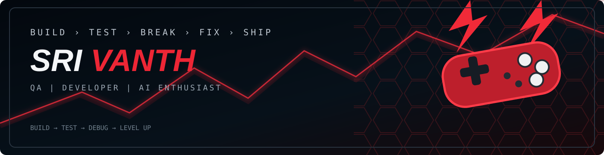

 

<table width="100%" border="1" cellpadding="12" cellspacing="0">
<tr>
<td width="16%" align="center" valign="middle">

</td>
<td width="59%" valign="middle">

# Srivanth S

### QA Engineer | Java Developer | AI/ML Enthusiast

📍 Perambalur, Tamil Nadu &nbsp;&nbsp;&nbsp; ✉️ [srivanthsekar11@gmail.com](mailto:srivanthsekar11@gmail.com)

📞 9345378806 &nbsp;&nbsp;&nbsp; 🔗 [linkedin.com/in/srivanth-sekar12](https://linkedin.com/in/srivanth-sekar12)

</td>
<td width="25%" align="center" valign="middle">

> **“Find the bug**  
> **before the user**  
> **finds it.”**

</td>
</tr>
</table>

 

<table width="100%" border="1" cellpadding="10" cellspacing="0">
<tr>
<td>

 &nbsp; <strong>TECH STACK</strong>
 
<i>Technologies I work with</i>

</td>
<td align="right">
<i>&lt;/&gt; Technologies I work with</i>
</td>
</tr>
<tr>
<td width="20%"><strong>▣ &nbsp; Languages</strong></td>
<td>

</td>
</tr>
<tr>
<td><strong>▣ &nbsp; Backend</strong></td>
<td>

</td>
</tr>
<tr>
<td><strong>▣ &nbsp; Frontend</strong></td>
<td>

</td>
</tr>
<tr>
<td><strong>▣ &nbsp; Database</strong></td>
<td>

</td>
</tr>
<tr>
<td><strong>▣ &nbsp; QA & Testing</strong></td>
<td>

</td>
</tr>
<tr>
<td><strong>▣ &nbsp; AI / ML</strong></td>
<td>

</td>
</tr>
</table>

 

<table width="100%" border="1" cellpadding="12" cellspacing="0">
<tr>
<td width="56%" valign="top">

 &nbsp; <strong>LEVEL-UP ROADMAP</strong>
 <i>Current Focus & Progress</i>

🔴 <strong>JAVA</strong>

<table width="100%">
<tr><td>DSA</td><td></td><td><strong>90%</strong></td></tr>
<tr><td>Collections</td><td></td><td><strong>80%</strong></td></tr>
<tr><td>Problem Solving</td><td></td><td><strong>80%</strong></td></tr>
</table>

🔴 <strong>SPRING BOOT</strong>

<table width="100%">
<tr><td>REST APIs</td><td></td><td><strong>70%</strong></td></tr>
<tr><td>Security / JWT</td><td></td><td><strong>60%</strong></td></tr>
<tr><td>Architecture</td><td></td><td><strong>50%</strong></td></tr>
</table>

🔴 <strong>QA</strong>

<table width="100%">
<tr><td>Manual Testing</td><td></td><td><strong>90%</strong></td></tr>
<tr><td>API Testing</td><td></td><td><strong>80%</strong></td></tr>
<tr><td>Automation Mindset</td><td></td><td><strong>60%</strong></td></tr>
</table>

</td>

<td width="44%" valign="top">

 &nbsp; <strong>WHAT I DO</strong>
 <i>More than just coding</i>

<table width="100%" cellpadding="10">
<tr><td width="18%" align="center">🧩</td><td><strong>Build</strong> Develop real-world projects with clean and scalable code.</td></tr>
<tr><td align="center">🔎</td><td><strong>Test</strong> Ensure quality with manual, functional and API testing.</td></tr>
<tr><td align="center">💡</td><td><strong>Explore</strong> Work on AI/ML and solve real-world problems.</td></tr>
<tr><td align="center">📖</td><td><strong>Learn</strong> Always stay curious to learn and improve.</td></tr>
</table>

</td>
</tr>
</table>

 

<table width="100%" border="1" cellpadding="12" cellspacing="0">
<tr>
<td colspan="3">

 &nbsp; <strong>FEATURED PROJECTS</strong>
 <i>Some of the things I've built</i>

</td>
</tr>
<tr>

<td width="33.33%" valign="top">

### 🏆 CodeArena
Competitive Coding Platform

Built a full-stack competitive coding platform with JWT auth, teacher & student dashboards, live code judge, AI hints, MCQ engine, XP system and analytics.

  
**[↗ VIEW PROJECT](https://github.com/srivanth1210/CodeArena)**

</td>

<td width="33.33%" valign="top">

### 🎁 Incentive & Gift Card Platform
QA Testing | Web, Android, iOS

Performed end-to-end manual testing including functional, regression and API testing for registration, wallet and redemption workflows. Supported UAT and production.

</td>

<td width="33.33%" valign="top">

### 🧠 ML Brightness Controller
AI / ML Project

Real-time screen brightness controller using hand-gesture recognition with OpenCV and MediaPipe.

  
**[↗ VIEW PROJECT](https://github.com/srivanth1210/ML-brightness-controller)**

</td>

</tr>
</table>

 

<table width="100%" border="1" cellpadding="12" cellspacing="0">
<tr>
<td width="58%" valign="middle">

 &nbsp; <strong>LET'S CONNECT</strong>
 Open to opportunities, collaborations and interesting projects.

</td>
<td width="42%" align="right" valign="middle">

</td>
</tr>
</table>

 

CODE → TEST → BREAK → FIX → SHIP

