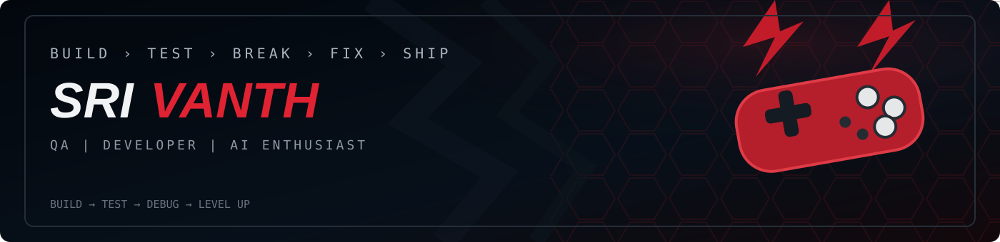

 

<table width="100%">
<tr>
<td width="16%" align="center" valign="middle">

</td>
<td width="59%" valign="middle">

# Srivanth S

### QA Engineer | Java Developer | AI/ML Enthusiast

📍 Perambalur, Tamil Nadu &nbsp;&nbsp; ✉️ [srivanthsekar11@gmail.com](mailto:srivanthsekar11@gmail.com)  
📞 9345378806 &nbsp;&nbsp; 🔗 [linkedin.com/in/srivanth-sekar12](https://linkedin.com/in/srivanth-sekar12)

</td>
<td width="25%" align="center" valign="middle">

> **“Find the bug**  
> **before the user**  
> **finds it.”**

</td>
</tr>
</table>

 

<table width="100%">
<tr>
<td colspan="2">

## 🟥 &nbsp; TECH STACK
<i>Technologies I work with</i>

</td>
</tr>
<tr>
<td width="20%"><b>▣ &nbsp; Languages</b></td>
<td>

</td>
</tr>
<tr>
<td><b>▣ &nbsp; Backend</b></td>
<td>

</td>
</tr>
<tr>
<td><b>▣ &nbsp; Frontend</b></td>
<td>

</td>
</tr>
<tr>
<td><b>▣ &nbsp; Database</b></td>
<td>

</td>
</tr>
<tr>
<td><b>▣ &nbsp; QA & Testing</b></td>
<td>

</td>
</tr>
<tr>
<td><b>▣ &nbsp; AI / ML</b></td>
<td>

</td>
</tr>
</table>

 

<table width="100%">
<tr>
<td width="56%" valign="top">

## 📊 &nbsp; LEVEL-UP ROADMAP
<i>Current Focus & Progress</i>

### 🔴 JAVA

**DSA**  
**█████████░** 90%

**Collections**  
**████████░░** 80%

**Problem Solving**  
**████████░░** 80%

### 🔴 SPRING BOOT

**REST APIs**  
**███████░░░** 70%

**Security / JWT**  
**██████░░░░** 60%

**Architecture**  
**█████░░░░░** 50%

### 🔴 QA

**Manual Testing**  
**█████████░** 90%

**API Testing**  
**████████░░** 80%

**Automation Mindset**  
**██████░░░░** 60%

</td>

<td width="44%" valign="top">

## ⚡ &nbsp; WHAT I DO
<i>More than just coding</i>

### 🧩 Build

**Develop real-world projects with clean and scalable code.**

---

### 🔎 Test

**Ensure quality with manual, functional and API testing.**

---

### 💡 Explore

**Work on AI/ML and solve real-world problems.**

---

### 📖 Learn

**Always stay curious to learn and improve.**

</td>
</tr>
</table>

 

<table width="100%">
<tr>
<td>

## 🚀 &nbsp; FEATURED PROJECTS
<i>Some of the things I've built</i>

</td>
</tr>
</table>

<table width="100%">
<tr>
<td width="33.33%" valign="top">

### 🏆 CodeArena

**Competitive Coding Platform**

Built a full-stack competitive coding platform with JWT auth, teacher & student dashboards, live code judge, AI hints, MCQ engine, XP system and analytics.

  

**[↗ VIEW PROJECT](https://github.com/srivanth1210/CodeArena)**

</td>

<td width="33%" valign="top">

### 🎁 Incentive & Gift Card Platform

**QA Testing | Web, Android, iOS**

Performed end-to-end manual testing including functional, regression and API testing for registration, wallet and redemption workflows. Supported UAT and production.

</td>

<td width="33%" valign="top">

### 🧠 ML Brightness Controller

**AI / ML Project**

Real-time screen brightness controller using hand-gesture recognition with OpenCV and MediaPipe.

  

**[↗ VIEW PROJECT](https://github.com/srivanth1210/ML-brightness-controller)**

</td>
</tr>
</table>

 

<table width="100%">
<tr>
<td width="58%" valign="middle">

## 📡 &nbsp; LET'S CONNECT

**Open to opportunities, collaborations and interesting projects.**

</td>
<td width="42%" align="right" valign="middle">

</td>
</tr>
</table>

 

**CODE → TEST → BREAK → FIX → SHIP**

